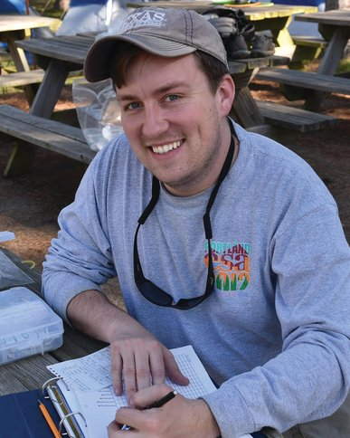

# Joseph Madison, Ph.D. (Principal Investigator)

### Joseph (Joe) Madison is an NSF Postdoctoral Research Fellow and Principal Investigator currently affiliated with the Woodhams Lab at the University of Massachusetts Boston. Joe is interested in microbial evolutionary ecology in the context of host-microbe interactions and macroevolutionary phenomena. Joe also works in the history and philosophy of biology. 

[Joe Madison's CV](./jmadison_cv_2021.pdf)

.jpg)

# Drew Davis, Ph.D. (Collaborator)

### Drew Davis is an Associate Research Scientist in the School of Earth, Environmental, and Marine Sciences at the University of Texas Rio Grande Valley. His research broadly centers on the ecology and conservation of amphibians and reptiles, primarily through understanding the distribution and diversity of species across the landscape and how stressors affect individuals and populations. To answer research questions, Drew uses emerging technologies (e.g., unmanned aerial vehicles and eDNA metabarcoding) to supplement traditional survey methodologies, laboratory experiments, and specimen-based studies using natural history collections.

