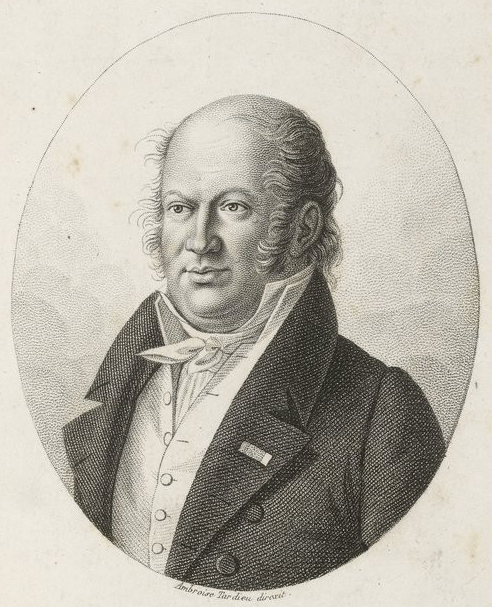

# Joseph Madison, Ph.D. (Principal Investigator)

### Joseph (Joe) Madison is an NSF Postdoctoral Research Fellow and Principal Investigator currently affiliated with the Woodhams Lab at the University of Massachusetts Boston. Joe is interested in microbial evolutionary ecology in the context of host-microbe interactions and macroevolutionary phenomena. Joe also works in the history and philosophy of biology. 

[Joe Madison's CV](./jmadison_cv_2021.pdf)

.jpg)

# Étienne Geoffroy Saint-Hilaire (Honorary Collaborator)

